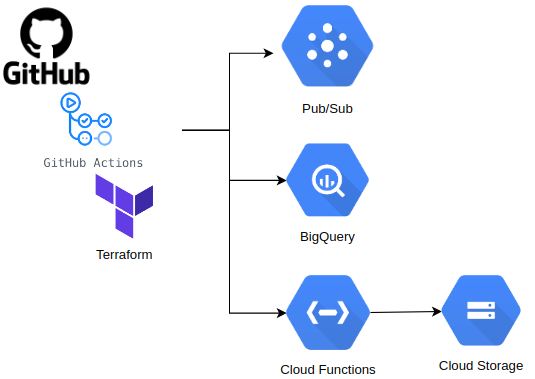
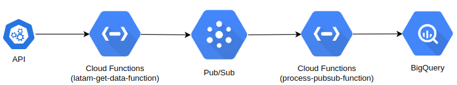

# LATAM DevSecOps/SRE Challenge

## Descripción General

Este proyecto resuelve el challenge DevSecOps/SRE para LATAM Airlines. El objetivo es desarrollar un sistema en la nube para ingestar, almacenar y exponer datos mediante el uso de IaC (Infraestructura como Código) y CI/CD (Integración Continua y Despliegue Continuo). El sistema incluye una API HTTP que interactúa con Google Cloud BigQuery para almacenar y recuperar datos.

## Estructura del Proyecto

El proyecto está organizado de la siguiente manera:

- `function/`: Contiene el código fuente de la función en la nube y las pruebas unitarias.
  - `main.py`: Implementación de la API HTTP utilizando Flask.
  - `requirements.txt`: Dependencias necesarias para ejecutar la API.
  - `test/`: Contiene pruebas unitarias para la API.
    - `test_main.py`: Pruebas unitarias para la API utilizando `unittest`.
  - `function-source.zip`: Código comprimido para la función en la nube.

- `terraform/`: Contiene la configuración de Terraform para desplegar la infraestructura en Google Cloud.
  - `main.tf`: Define la infraestructura necesaria (Pub/Sub, BigQuery, Cloud Functions).
  - `variables.tf`: Variables utilizadas en la configuración de Terraform.
  - `outputs.tf`: Define los outputs de la configuración de Terraform.

- `cloud_function_pubsub/`: Contiene la configuración y el código fuente para la función en la nube que maneja mensajes de Pub/Sub.
  - `main.py`: Código de la función que procesa mensajes.
  - `requirements.txt`: Dependencias necesarias para ejecutar la función.
  - `test/`: Pruebas unitarias para la función de Pub/Sub.

- `.github/workflows/deploy.yml`: Configura un flujo de trabajo de GitHub Actions para automatizar el despliegue de la API y la infraestructura.

## Despliegue de la Infraestructura

El despliegue de la infraestructura se realiza utilizando Terraform. La infraestructura incluye:
- **Google Cloud Pub/Sub**: Para ingestar los datos.
- **Google Cloud BigQuery**: Para almacenar los datos.
- **Google Cloud Functions**: Para exponer los datos mediante una API HTTP.

### Pasos para Desplegar

1. Clonar este repositorio.
2. Configurar las variables necesarias en `variables.tf`.
3. Ejecutar los comandos de Terraform:
   ```bash
   terraform init
   terraform plan -var="project_id=<PROJECT_ID>"
   terraform apply -auto-approve -var="project_id=<PROJECT_ID>"

## API HTTP

La API está implementada en Python utilizando Flask y está configurada para manejar solicitudes POST que insertan datos en BigQuery.

### Endpoint:
- **POST /**: Inserta datos en BigQuery.

### Ejemplo de solicitud:
```bash
curl -X POST https://<CLOUD_FUNCTION_URL> -H "Content-Type: application/json" -d '{
      "data": {
        "id": "123",
        "name": "Sample Data",
        "value": 45.67
      }
    }'
```

### Respuesta esperada:
- **Éxito**: 
  - Código de estado: `200 OK`
  - Cuerpo de la respuesta:
    ```json
    {
      "success": true,
      "message": "Data inserted successfully!"
    }
    ```
- **Error**: 
  - Código de estado: `400 Bad Request` o `500 Internal Server Error`
  - Cuerpo de la respuesta (ejemplo para un error de validación):
    ```json
    {
      "success": false,
      "error": "Invalid input data"
    }
    ```

### Validación de datos:
La API espera recibir un JSON con la estructura siguiente:
```json
{
  "data": {
    "id": "string",
    "name": "string",
    "value": "number"
  }
}
```
Si los datos no cumplen con esta estructura, la API responderá con un error `400 Bad Request`.

### Funcionamiento Interno:
1. **Validación**: La API primero valida que el JSON recibido contiene las claves necesarias (`id`, `name`, `value`).
2. **Inserción en BigQuery**: Si la validación es exitosa, los datos se insertan en una tabla de BigQuery.
3. **Manejo de Errores**: Si ocurre algún error durante la inserción, la API responde con un código `500 Internal Server Error` y un mensaje que detalla el error.

### Configuración en Google Cloud:
Para desplegar esta API en Google Cloud Functions:
1. **Configurar el proyecto de Google Cloud**: Asegúrate de que las credenciales de Google Cloud estén configuradas correctamente.
2. **Desplegar la API**: Utiliza el flujo de trabajo de GitHub Actions (`deploy.yml`) para automatizar el despliegue.

## Pruebas

Las pruebas unitarias están ubicadas en `function/test/test_main.py` y se encargan de validar el correcto funcionamiento de la API.

### Ejecutar Pruebas:
Las pruebas se pueden ejecutar manualmente con el siguiente comando:
```python -m unittest discover function/test
```

Estas pruebas también se ejecutan automáticamente durante el pipeline CI/CD configurado en GitHub Actions.

### Cobertura de Pruebas:
La prueba incluida verifica que la API responde correctamente a una solicitud válida y maneja adecuadamente los errores de entrada.

### Métricas Propuestas
1. **Número de solicitudes procesadas**: Para monitorear la cantidad de datos ingresados.
2. **Latencia de la API**: Para asegurar que la API responde en un tiempo aceptable.
3. **Errores de inserción en BigQuery**: Para detectar problemas en el almacenamiento de datos.

### Herramienta de Monitoreo
Para visualizar y alertar sobre métricas se recomienda el uso de **Grafana** 

### Reglas de Alertas
- **Latencia alta**: Si la latencia de la API supera los 200ms.
- **Errores de inserción**: Si se detectan más de 5 errores de inserción en un período de 10 minutos.

### SLI (Service Level Indicator) y SLO (Service Level Objective)
- **Disponibilidad de la API**: SLI del 99.9% con un SLO que se monitorea y alerta cuando baja del 99.5%.

## Mejoras Futuras

- Implementar pruebas de integración más complejas que involucren todo el flujo de datos.
- Automatizar la configuración y monitoreo de las métricas.
- Expandir la funcionalidad de la API para soportar operaciones de lectura y actualización.


## Diagrama
### DEPLOY


### INGESTA



